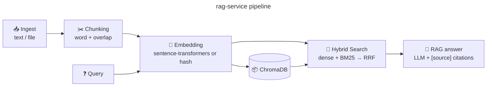

# 🧠 RAG Service

**Production-style RAG API** with hybrid retrieval — dense embeddings + BM25-style
keyword scoring fused with **Reciprocal Rank Fusion (RRF)** over a ChromaDB vector
store. Grounded answers with `[source]` citations via any OpenAI-compatible chat
endpoint, or a fully offline fallback.


- **License:** GPL-3.0-or-later
- **Owner:** Gagan Jain ([@gaganjainse](https://github.com/gaganjainse))
- **Stack:** Python 3.12 · FastAPI · ChromaDB


## Quick start

```bash
pip install -r requirements.txt
uvicorn app.main:app --reload
```

```bash
curl -X POST localhost:8000/ingest/text \
  -H 'Content-Type: application/json' \
  -d '{"text": "VIT Vellore focuses on AI and systems...", "source": "vit"}'

curl -X POST localhost:8000/ask \
  -H 'Content-Type: application/json' \
  -d '{"question": "What does the CS program focus on?", "k": 3}'
```

Docker: `docker compose up` (persistent ChromaDB volume).

## Features

- `POST /ingest/text` & `POST /ingest/file` — word-based chunking (with overlap), index into ChromaDB
- `POST /search` — hybrid retrieval (vector + keyword), RRF merge
- `POST /ask` — RAG answer with `[source]` citations
- Embedding backends: `sentence-transformers` (real) or a deterministic hashing embedder (offline/dev), selected via `EMBEDDING_BACKEND`
- LLM: OpenAI-compatible `chat/completions`; offline echo fallback when no `OPENAI_API_KEY`
- Dependency injection via FastAPI lifespan (no import-time model loads); `CHROMA_DIR` overrides the store path

## Endpoints

| Method | Path | Purpose |
|---|---|---|
| GET | `/health` | liveness + document count |
| POST | `/ingest/text` | index text |
| POST | `/ingest/file` | index a UTF-8 file |
| POST | `/search` | hybrid retrieval |
| POST | `/ask` | grounded answer + citations |
| GET | `/stats` | document count |

## Architecture



## Development

```bash
pytest -q                     # 22 tests
ruff check app/ tests/        # lint
```

## License

GPL-3.0-or-later — see [LICENSE](LICENSE).

## Status

CI green. Security: [SECURITY.md](SECURITY.md). Compiled reading:
[shesh-docs](https://github.com/gaganjainse/shesh-docs).
